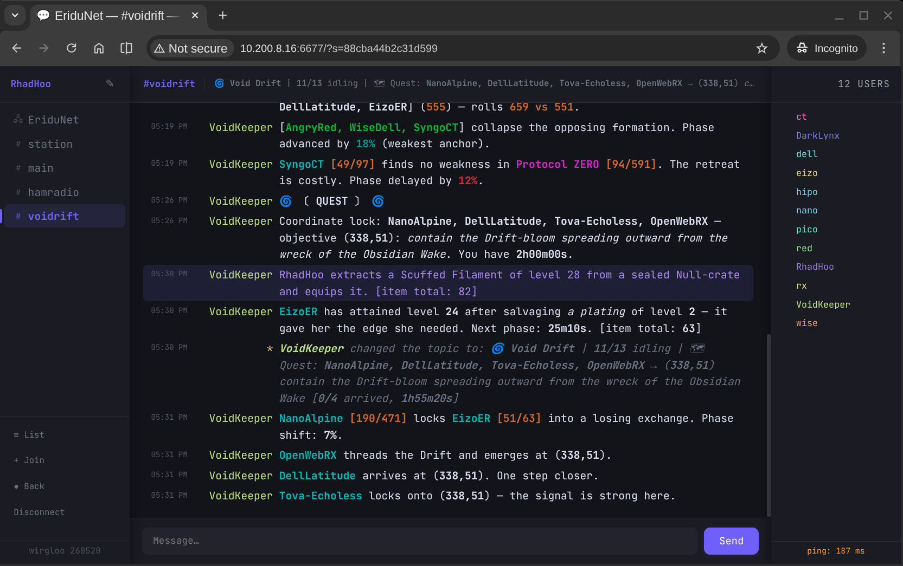

# Void Drift — IRC IdleRPG Bot

[](https://go.dev/)
[](LICENSE)
[](https://goreportcard.com/report/github.com/cstroie/voidrift)

A standalone IRC bot implementing the classic [IdleRPG](https://idlerpg.net/) game, written in Go — with a cosmic horror / dying-world sci-fi skin.

The old gods are gone. What remains are Entities: the Pale Architects, the Drift, the Deep Signal, Protocol ZERO. Players register a character, pick a class and alignment, and gain levels simply by idling in the channel. Talking, changing nick, parting, quitting, or getting kicked adds penalty time. Characters battle each other on level-up, find salvaged artefacts, join guilds, go on missions, and roam a 500×500 map — all without lifting a finger.

See [MANUAL.md](MANUAL.md) for full player documentation: commands, mechanics, and strategy.



## Quickstart

**Prerequisites**: Go 1.21 or later.

```bash
git clone https://github.com/cstroie/voidrift.git
cd voidrift
make build
./voidrift -server irc.libera.chat:6667 -nick VoidKeeper -channel "#voidrift"
```

The bot connects, joins the channel, and begins the game loop immediately. Player data is saved automatically to `voidrift.json`; guild data to `guilds.json`.

To test locally without a live IRC server, use dev mode (14× faster TTL, event rates ×10, weak creeps, easy quests, auto-logins existing channel members on connect):

```bash
make dev
```

## Building & Testing

```bash
make build   # compile; binary stamped with today's date (yymmdd)
make test    # run unit tests
make run     # build and run with default flags
make dev     # build and run in dev mode
make clean   # remove the binary
```

You can override connection defaults without editing the Makefile:

```bash
make run SERVER=irc.example.org:6667 NICK=MyBot CHANNEL='#mygame'
```

## Configuration

All settings can be provided as command-line flags, environment variables, or
(for service deployments) via an env file loaded by the init script. Priority
order: **flag > env var > compiled-in default**.

### Flags and environment variables

| Flag | Env var | Default | Description |
|------|---------|---------|-------------|
| **Connection** |
| `-server` | `VOIDRIFT_SERVER` | `irc.libera.chat:6667` | IRC server `host:port` |
| `-nick` | `VOIDRIFT_NICK` | `VoidKeeper` | Bot nick |
| `-server-pass` | `VOIDRIFT_SERVER_PASS` | _(none)_ | IRC server password |
| `-nickserv-pass` | `VOIDRIFT_NICKSERV_PASS` | _(none)_ | NickServ password — sends `IDENTIFY` on connect |
| `-ssl` | `VOIDRIFT_SSL` | `false` | Use SSL/TLS |
| `-no-verify` | `VOIDRIFT_NO_VERIFY` | `false` | Skip TLS certificate verification (insecure) |
| **Game** |
| `-channel` | `VOIDRIFT_CHANNEL` | `#voidrift` | Game channel |
| `-data` | `VOIDRIFT_DATA` | `voidrift.json` | Player data file (created automatically) |
| `-guilds` | `VOIDRIFT_GUILDS` | `guilds.json` | Guild data file (created automatically) |
| **Tuning** |
| `-dev` | `VOIDRIFT_DEV` | `false` | Dev mode: auto-login channel members on startup, TTL 14× faster, event rates ×10, creep levels capped at 10, quests require only 1 player at level 0+ |
| `-rate-player` | `VOIDRIFT_RATE_PLAYER` | `1.0` | Per-player event rate multiplier — scales random events and bot battles |
| `-rate-align` | `VOIDRIFT_RATE_ALIGN` | `1.0` | Alignment event rate multiplier — scales good/evil daily events |
| `-rate-server` | `VOIDRIFT_RATE_SERVER` | `1.0` | Server event rate multiplier — scales team/guild battles, quests, Hand of God |
| **Extra** |
| `-log` | `VOIDRIFT_LOG` | _(none)_ | Append log output to this file (stdout always active) |
| `-version` | — | `false` | Print version and exit |

### Env file

For service deployments copy `init/voidrift.env.example` to
`/etc/voidrift/voidrift.env` (mode `0600`, owned by `root`) and set your
values there. Secrets such as `VOIDRIFT_NICKSERV_PASS` and `VOIDRIFT_SERVER_PASS`
should only ever live in this file, not on the command line.

## Running as a Service

The Makefile handles everything automatically:

```bash
sudo make install    # build and install binary, create user, install init file
sudo make uninstall  # stop service, remove init file and binary
```

`make install` installs the binary to `/usr/local/bin/voidrift`, creates
`/var/lib/voidrift` as the data directory, and detects the init system
automatically (Alpine Linux → OpenRC, anything with `/run/systemd/system` →
systemd). After installing, configure the bot by copying the env-file template:

```bash
cp /etc/voidrift/voidrift.env.example /etc/voidrift/voidrift.env
chmod 600 /etc/voidrift/voidrift.env
$EDITOR /etc/voidrift/voidrift.env   # set VOIDRIFT_NICKSERV_PASS, etc.
```

Then start the service:

```bash
# systemd
systemctl start voidrift

# OpenRC
rc-service voidrift start
```

`make uninstall` stops and disables the service and removes the binary, but
**preserves** data (`/var/lib/voidrift/*.json`) and config (`/etc/voidrift/`).

### Manual installation

If you prefer to install without `make`, copy the binary to `/usr/local/bin/`
and pick the appropriate init file from the `init/` directory. The systemd
unit runs the bot as the `voidrift` user with `WorkingDirectory=/var/lib/voidrift`;
the OpenRC script does the same via `command_user` and `directory`.

## drifter — idle client

`drifter` is a companion binary in this repo: a minimal IRC client that connects
to the server, joins the channel, sends `!login`, and idles — no interaction
required. All channel messages are printed to stdout.

```bash
go build ./cmd/drifter
./drifter -nick MyChar -game-pass s3cr3t
./drifter -nick MyChar -game-pass s3cr3t -log voidrift-MyChar.log
```

| Flag | Default | Description |
|------|---------|-------------|
| **Connection** |
| `-server` | `irc.libera.chat:6667` | IRC server `host:port` |
| `-nick` | _(required)_ | IRC nick |
| `-server-pass` | _(none)_ | IRC server password |
| `-nickserv-pass` | _(none)_ | NickServ IDENTIFY password |
| `-ssl` | `false` | Use SSL/TLS |
| `-no-verify` | `false` | Skip TLS certificate verification (insecure) |
| **Game** |
| `-channel` | `#voidrift` | Channel to join |
| `-bot` | `VoidKeeper` | Bot nick to DM `!login` to |
| `-game-pass` | _(required)_ | Game password for `!login` |
| **Extra** |
| `-log` | _(none)_ | Append messages to this file (stdout always active) |
| `-version` | `false` | Print version and exit |

`drifter` reconnects automatically after a 10-second delay on disconnect.
On a clean shutdown (Ctrl-C, `kill`, service stop) it sends `!logout` first to avoid the quit penalty.

Channel messages are printed to stdout with **ANSI colours** matching the IRC formatting. If a log file is specified via `-log`, it receives plain stripped text instead.

## Contributing

Bug reports and pull requests are welcome. Please:

1. Fork the repo and create a feature branch.
2. Run `make test` before submitting — all tests must pass.
3. Keep each PR focused; one change per PR.

## Maintainer

Costin Stroie — <costinstroie@eridu.eu.org>

## License

[GNU General Public License v3.0](LICENSE)
